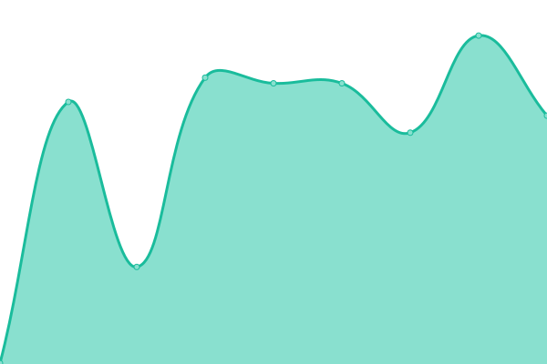
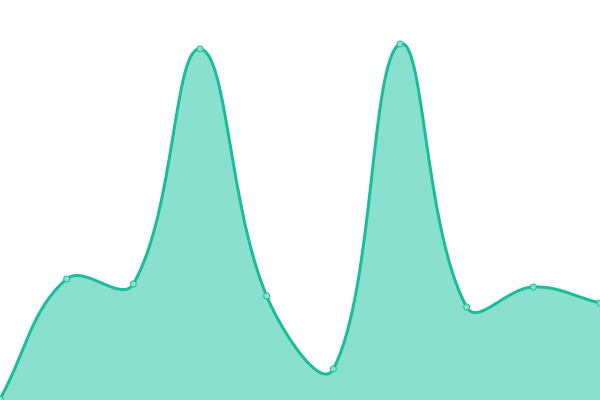
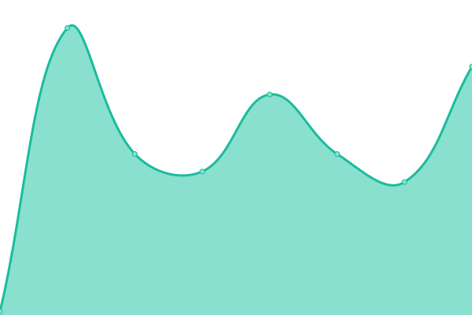
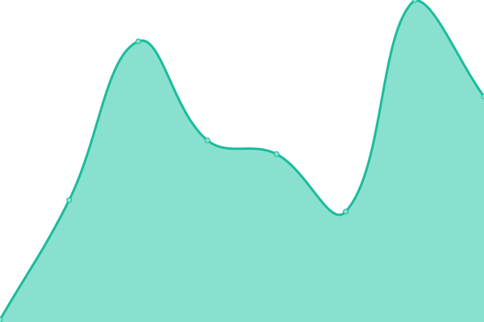
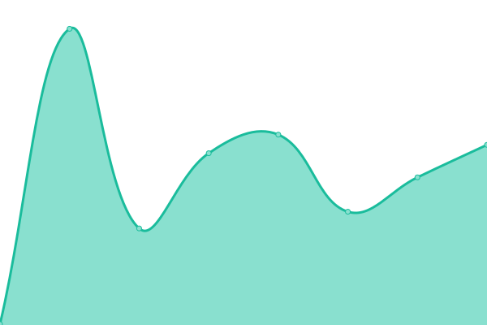
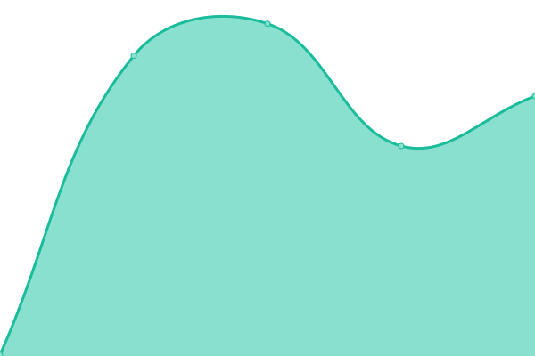

# [📈 Live Status](https://status.dynamisai.io): <!--live status--> **🟧 Partial outage**

This repository contains the open-source uptime monitor and status page for [James Tsetsekas](JamesTsetsekas.com), powered by [Upptime](https://github.com/upptime/upptime).

With [Upptime](https://upptime.js.org), you can get your own unlimited and free uptime monitor and status page, powered entirely by a GitHub repository. We use [Issues](https://github.com/JamesTsetsekas/dynamisai-status/issues) as incident reports, [Actions](https://github.com/JamesTsetsekas/dynamisai-status/actions) as uptime monitors, and [Pages](https://status.dynamisai.io) for the status page.

<!--start: status pages-->
<!-- This summary is generated by Upptime (https://github.com/upptime/upptime) -->
<!-- Do not edit this manually, your changes will be overwritten -->
<!-- prettier-ignore -->
| URL | Status | History | Response Time | Uptime |
| --- | ------ | ------- | ------------- | ------ |
|  [Dynamis AI Website](https://dynamisai.io) | 🟩 Up | [dynamis-ai-website.yml](https://github.com/JamesTsetsekas/dynamisai-status/commits/HEAD/history/dynamis-ai-website.yml) | 

 384ms
     
 | 

<a href="https://status.dynamisai.io/history/dynamis-ai-website">99.77%</a>
    

|  [Dynamis AI Dashboard](https://dynamisai.io/dashboard/login) | 🟩 Up | [dynamis-ai-dashboard.yml](https://github.com/JamesTsetsekas/dynamisai-status/commits/HEAD/history/dynamis-ai-dashboard.yml) | 

 162ms
     
 | 

<a href="https://status.dynamisai.io/history/dynamis-ai-dashboard">99.77%</a>
    

|  [Dynamis Managed AI](https://openrouter.ai/api/v1/models) | 🟥 Down | [dynamis-managed-ai.yml](https://github.com/JamesTsetsekas/dynamisai-status/commits/HEAD/history/dynamis-managed-ai.yml) | 

 3288ms
     
 | 

<a href="https://status.dynamisai.io/history/dynamis-managed-ai">98.91%</a>
    

|  [Anthropic API](https://api.anthropic.com/v1/messages) | 🟩 Up | [anthropic-api.yml](https://github.com/JamesTsetsekas/dynamisai-status/commits/HEAD/history/anthropic-api.yml) | 

 80ms
     
 | 

<a href="https://status.dynamisai.io/history/anthropic-api">100.00%</a>
    

|  [OpenAI API](https://api.openai.com/v1/models) | 🟩 Up | [open-ai-api.yml](https://github.com/JamesTsetsekas/dynamisai-status/commits/HEAD/history/open-ai-api.yml) | 

 104ms
     
 | 

<a href="https://status.dynamisai.io/history/open-ai-api">100.00%</a>
    

|  [Google AI API](https://generativelanguage.googleapis.com/v1beta/models) | 🟩 Up | [google-ai-api.yml](https://github.com/JamesTsetsekas/dynamisai-status/commits/HEAD/history/google-ai-api.yml) | 

 141ms
     
 | 

<a href="https://status.dynamisai.io/history/google-ai-api">100.00%</a>
    

|  [Groq API](https://api.groq.com/openai/v1/models) | 🟩 Up | [groq-api.yml](https://github.com/JamesTsetsekas/dynamisai-status/commits/HEAD/history/groq-api.yml) | 

 171ms
     
 | 

<a href="https://status.dynamisai.io/history/groq-api">100.00%</a>
    

|  [Mistral API](https://api.mistral.ai/v1/models) | 🟩 Up | [mistral-api.yml](https://github.com/JamesTsetsekas/dynamisai-status/commits/HEAD/history/mistral-api.yml) | 

 290ms
     
 | 

<a href="https://status.dynamisai.io/history/mistral-api">100.00%</a>
    

<!--end: status pages-->

[**Visit our status website →**](https://status.dynamisai.io)

## 📄 License

- Powered by: [Upptime](https://github.com/upptime/upptime)
- Code: [MIT](./LICENSE) © [Anand Chowdhary](https://anandchowdhary.com), supported by [Pabio](https://pabio.com)
- Data in the `./history` directory: [Open Database License](https://opendatacommons.org/licenses/odbl/1-0/)
